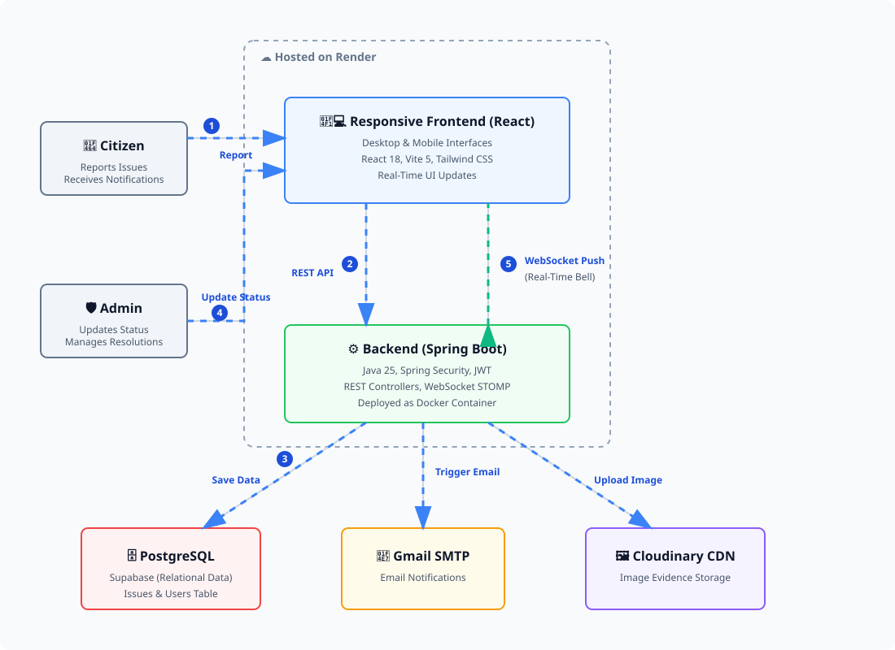

<div align="center">

# 🏛️ CivicPulse

### Community Issue Reporting & Resolution Platform

[](https://openjdk.org/)
[](https://spring.io/projects/spring-boot)
[](https://react.dev/)
[](https://supabase.com/)
[](https://tailwindcss.com/)
[](https://render.com/)

*Empowering citizens to report local civic issues — and empowering authorities to resolve them.*

[Live Frontend](https://civicpulse-frontend-3mb8.onrender.com) · [Live Backend API](https://civicpulse-d6a0.onrender.com) · [Report Bug](https://github.com/gms26/CivicPulse/issues)

</div>

---

## 📋 Table of Contents

- [About](#-about)
- [Live Demo](#-live-demo)
- [Tech Stack](#-tech-stack)
- [Features](#-features)
- [Project Structure](#-project-structure)
- [Architecture](#-architecture)
- [API Endpoints](#-api-endpoints)
- [Local Setup](#-local-setup)
- [Environment Variables](#-environment-variables)
- [Deployment](#-deployment-rendercom)
- [License](#-license)

---

## 📖 About

**CivicPulse** is a production-grade, full-stack web application that bridges the gap between citizens and local authorities. Citizens can report civic issues (broken roads, water leaks, power outages, sanitation problems, etc.) with photos and location data. Administrators can manage, prioritize, assign, and resolve issues — with real-time notifications and email alerts keeping everyone in the loop.

The platform includes public analytics dashboards, paginated data views, issue audit timelines, and a responsive design that works seamlessly on desktop and mobile.

---

## 🚀 Live Demo

| Service | URL |
|---------|-----|
| **Frontend** (Citizen & Admin Portal) | [https://civicpulse-frontend-3mb8.onrender.com](https://civicpulse-frontend-3mb8.onrender.com) |
| **Backend** (REST API & WebSockets) | [https://civicpulse-d6a0.onrender.com](https://civicpulse-d6a0.onrender.com) |

> **Note:** Free-tier Render services may spin down after inactivity. The first request might take 30–60 seconds to wake the server.

### Demo Credentials
| Role | Email | Password |
|------|-------|----------|
| Citizen | Register a new account | — |
| Admin | *(Pre-seeded via data.sql)* | — |

---

## 🛠 Tech Stack

### Backend
| Technology | Version | Purpose |
|------------|---------|---------|
| **Java** | 25 | Core language (no Lombok — standard Java boilerplate) |
| **Spring Boot** | 3.3.5 | REST API framework, dependency injection, auto-config |
| **Spring Security** | 6.x | Authentication & authorization (JWT + role-based) |
| **Spring Data JPA** | 3.x | ORM / database access layer |
| **Spring WebSocket** | STOMP | Real-time push notifications |
| **Spring Mail** | JavaMailSender | Email notifications (Gmail SMTP) |
| **PostgreSQL** | 15+ | Relational database (hosted on Supabase) |
| **Cloudinary** | SDK 1.34 | Image upload & CDN hosting |
| **JJWT** | 0.12.6 | JWT token creation & validation |
| **Maven** | Wrapper | Build & dependency management |
| **Docker** | Dockerfile | Containerized production deployment |

### Frontend
| Technology | Version | Purpose |
|------------|---------|---------|
| **React** | 18 | UI library (functional components + hooks) |
| **Vite** | 5 | Build tool & dev server |
| **Tailwind CSS** | v3 | Utility-first CSS framework |
| **React Router** | v6 | Client-side routing & navigation |
| **Axios** | — | HTTP client with interceptors |
| **Recharts** | — | Data visualization (charts & graphs) |
| **React Hot Toast** | — | Toast notification system |
| **Lucide React** | — | Modern icon library |
| **STOMP.js + SockJS** | — | WebSocket client for real-time updates |

### Infrastructure
| Service | Purpose |
|---------|---------|
| **Render** | Cloud hosting (backend Web Service + frontend Static Site) |
| **Supabase** | Managed PostgreSQL database |
| **Cloudinary** | Image storage & CDN |
| **Gmail SMTP** | Transactional email delivery |

---

## ✨ Features

### 🔐 Authentication & Authorization
- JWT-based stateless authentication
- Role-based access control: **Citizen** and **Admin** roles
- Secure password hashing with BCrypt
- Auto-redirect based on role after login
- Token stored in `localStorage` with auto-refresh interceptors

### 📝 Issue Reporting (Citizen)
- Report civic issues with title, description, and category
- Upload photo evidence via Cloudinary integration
- Specify location address with coordinates
- View personal dashboard with all reported issues
- Track issue status changes in real-time

### 🛡️ Admin Management Console
- View all reported issues with filters (status, category, priority, keyword search)
- Update issue status: `OPEN` → `IN_PROGRESS` → `RESOLVED`
- Set issue priority: `LOW` | `MEDIUM` | `HIGH` | `CRITICAL`
- Assign issues to specific admin users
- Add comments on status changes (visible in audit trail)

### 🔔 Real-Time Notifications
- WebSocket-powered instant push notifications (STOMP protocol)
- Citizens notified immediately when their issue status changes
- Notification bell with unread count badge
- Mark individual or all notifications as read

### 📧 Email Notifications
- Branded HTML email sent on every status change
- Professional template with CivicPulse blue header
- Shows old status → new status with color-coded badges
- Includes admin comment and "View on CivicPulse" CTA button
- Graceful fallback — email failure never breaks the status update
- Configurable via `MAIL_USERNAME` and `MAIL_APP_PASSWORD` env vars

### 📊 Public Analytics Dashboard
- Open to everyone — no login required
- Interactive charts built with Recharts:
  - Issues by category (bar chart)
  - Issues by status (pie chart)
  - Resolution trends over time
- High-level KPI cards (total issues, resolved count, resolution rate)

### 📄 Paginated Dashboards
- 10 issues per page across all dashboards
- Page number buttons with smart ellipsis (max 5 visible)
- Previous / Next navigation with disabled states
- "Showing X–Y of Z issues" summary text
- Reusable `Pagination` component shared across Citizen & Admin views

### 🕐 Issue Timeline / Audit Trail
- Full chronological history of every issue
- Vertical timeline with color-coded status dots:
  - 🔵 Blue — Issue Created
  - 🔴 Red — OPEN
  - 🟡 Amber — IN PROGRESS
  - 🟢 Green — RESOLVED
- Shows who made each change, when, and their comment
- Accessible via `[Details] [Timeline]` tabs in the issue detail modal
- Timeline lazy-loaded on tab click for performance
- Auth-required endpoint (not publicly accessible)

---

## 📁 Project Structure

```
CivicPulse/
├── backend/                          # Spring Boot API
│   ├── src/main/java/com/civicpulse/
│   │   ├── config/                   # Security, CORS, WebSocket, Cloudinary, JWT filter
│   │   ├── controller/               # REST controllers (Auth, Issue, Admin, Analytics, Notification)
│   │   ├── dto/
│   │   │   ├── request/              # IssueCreateRequest, IssueUpdateRequest, LoginRequest, RegisterRequest
│   │   │   └── response/             # IssueResponse, IssueUpdateResponse, AuthResponse, AnalyticsResponse, NotificationResponse
│   │   ├── entity/                   # JPA entities (User, Issue, IssueUpdate, Notification)
│   │   │   └── enums/                # IssueStatus, IssueCategory, Priority, Role
│   │   ├── exception/                # Global exception handler + custom exceptions
│   │   ├── repository/               # Spring Data JPA repositories
│   │   └── service/                  # Business logic (Issue, Admin, Auth, Email, Notification, Analytics, Cloudinary, JWT)
│   ├── src/main/resources/
│   │   ├── application.yml           # Config (DB, JPA, Mail, JWT, Cloudinary)
│   │   └── data.sql                  # Seed data
│   ├── Dockerfile                    # Production container
│   └── pom.xml                       # Maven dependencies
│
├── frontend/                         # React SPA
│   ├── src/
│   │   ├── api/                      # Axios API layer (auth, issue, admin, analytics)
│   │   ├── components/
│   │   │   ├── common/               # Button, Card, Loader, Modal, StatusBadge, Pagination
│   │   │   ├── dashboard/            # Dashboard-specific widgets
│   │   │   ├── issues/               # IssueCard, IssueDetailModal, IssueFilters, IssueTimeline
│   │   │   └── layout/              # Navbar, Footer, NotificationBell
│   │   ├── context/                  # AuthContext (React Context API)
│   │   ├── hooks/                    # useAuth, useWebSocket
│   │   ├── pages/
│   │   │   ├── admin/                # AdminDashboard, AdminAnalytics
│   │   │   ├── public/               # PublicDashboard
│   │   │   ├── CitizenDashboard.jsx
│   │   │   ├── ReportIssuePage.jsx
│   │   │   ├── LoginPage.jsx
│   │   │   └── RegisterPage.jsx
│   │   ├── App.jsx                   # Routes & layout
│   │   └── main.jsx                  # Entry point
│   ├── tailwind.config.js
│   ├── vite.config.js
│   └── package.json
│
└── README.md
```

---

## 🏗 Architecture

<div align="center">
  
</div>

---

## 🔌 API Endpoints

### Authentication
| Method | Endpoint | Description | Auth |
|--------|----------|-------------|------|
| `POST` | `/api/auth/register` | Register new citizen | No |
| `POST` | `/api/auth/login` | Login and receive JWT | No |

### Issues (Citizen)
| Method | Endpoint | Description | Auth |
|--------|----------|-------------|------|
| `POST` | `/api/issues` | Create issue (multipart with image) | Citizen |
| `GET` | `/api/issues` | List all issues (paginated, filtered) | No |
| `GET` | `/api/issues/my` | Get current user's issues | Citizen |
| `GET` | `/api/issues/{id}` | Get issue details | No |
| `GET` | `/api/issues/{id}/timeline` | Get issue audit timeline | Authenticated |
| `DELETE` | `/api/issues/{id}` | Delete own issue | Citizen |

### Admin
| Method | Endpoint | Description | Auth |
|--------|----------|-------------|------|
| `GET` | `/api/admin/issues` | List all issues (admin view) | Admin |
| `PUT` | `/api/admin/issues/{id}/status` | Update issue status | Admin |
| `PUT` | `/api/admin/issues/{id}/priority` | Set issue priority | Admin |
| `PUT` | `/api/admin/issues/{id}/assign` | Assign issue to admin | Admin |

### Analytics
| Method | Endpoint | Description | Auth |
|--------|----------|-------------|------|
| `GET` | `/api/analytics/summary` | Dashboard KPI stats | No |
| `GET` | `/api/analytics/by-category` | Issues grouped by category | No |
| `GET` | `/api/analytics/by-status` | Issues grouped by status | No |

### Notifications
| Method | Endpoint | Description | Auth |
|--------|----------|-------------|------|
| `GET` | `/api/notifications` | Get user notifications (paginated) | Authenticated |
| `PUT` | `/api/notifications/{id}/read` | Mark notification as read | Authenticated |
| `PUT` | `/api/notifications/read-all` | Mark all as read | Authenticated |

### WebSocket
| Endpoint | Description |
|----------|-------------|
| `ws://host/ws` | STOMP WebSocket connection |
| `/user/queue/notifications` | User-specific notification channel |

---

## 💻 Local Setup

### Prerequisites
- Java 25+ (or 17+ with adjustment in `pom.xml`)
- Node.js 20+
- PostgreSQL (local or remote)
- A free [Cloudinary](https://cloudinary.com/) account

### 1. Clone the Repository
```bash
git clone https://github.com/gms26/CivicPulse.git
cd CivicPulse
```

### 2. Backend Setup
```bash
cd backend

# Create a PostgreSQL database named 'civicpulse'
# Default expects localhost:5432, user: postgres, pass: postgres

# Run the application
./mvnw spring-boot:run        # Linux/Mac
.\mvnw.cmd spring-boot:run    # Windows
```
Backend starts on `http://localhost:8080`

### 3. Frontend Setup
```bash
cd frontend
npm install
npm run dev
```
Frontend starts on `http://localhost:5173`

> **Note:** In dev mode, Vite proxies `/api` requests to `localhost:8080` automatically.

---

## 🔐 Environment Variables

### Backend
| Variable | Description | Example |
|----------|-------------|---------|
| `PORT` | Server port | `8080` |
| `DB_URL` | PostgreSQL JDBC URL | `jdbc:postgresql://host:5432/civicpulse` |
| `DB_USERNAME` | Database username | `postgres` |
| `DB_PASSWORD` | Database password | `your-password` |
| `JWT_SECRET` | 256-bit+ signing key (Base64) | `Y2l2aWNwdWxzZS1q...` |
| `JWT_EXPIRATION` | Token expiry in ms | `86400000` (24h) |
| `CLOUDINARY_CLOUD_NAME` | Cloudinary cloud name | `your-cloud` |
| `CLOUDINARY_API_KEY` | Cloudinary API key | `123456789` |
| `CLOUDINARY_API_SECRET` | Cloudinary API secret | `your-secret` |
| `FRONTEND_URL` | CORS allowed origin | `https://your-frontend.onrender.com` |
| `MAIL_USERNAME` | Gmail address for sending emails | `your-email@gmail.com` |
| `MAIL_APP_PASSWORD` | Gmail App Password (16 chars) | `xxxx-xxxx-xxxx-xxxx` |

> ⚠️ **MAIL_APP_PASSWORD** must be a Gmail App Password, NOT your regular Gmail password.
> Generate one at: Google Account → Security → 2-Step Verification → App Passwords.
> If not configured, the app works normally — email notifications are silently skipped.

### Frontend
| Variable | Description | Example |
|----------|-------------|---------|
| `VITE_API_URL` | Deployed backend URL | `https://civicpulse-d6a0.onrender.com` |
| `VITE_WS_URL` | Backend URL for WebSocket | `https://civicpulse-d6a0.onrender.com` |

---

## 🚀 Deployment (Render.com)

### 1. Database
- Create a PostgreSQL instance on **Supabase** (or Render)
- Copy the connection URL

### 2. Backend (Web Service)
- Connect to this GitHub repo
- Root Directory: `backend`
- Docker auto-detected via `Dockerfile`
- Set all backend environment variables in Render dashboard

### 3. Frontend (Static Site)
- Root Directory: `frontend`
- Build Command: `npm run build`
- Publish Directory: `dist`
- Set `VITE_API_URL` and `VITE_WS_URL` environment variables

### 4. Email Setup (Optional)
- Add `MAIL_USERNAME` and `MAIL_APP_PASSWORD` to backend environment
- Emails are automatically sent when admin updates issue status

---

## 📄 License

This project is licensed under the **MIT License**.

---

<div align="center">

**Built with ❤️ by [gms26](https://github.com/gms26)**

</div>
